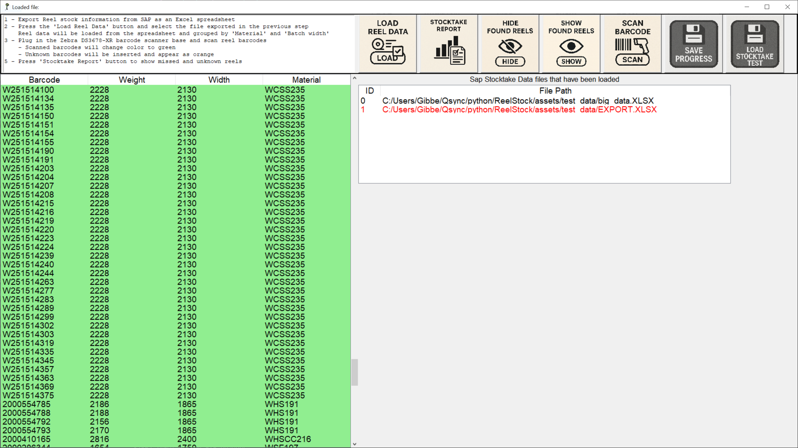
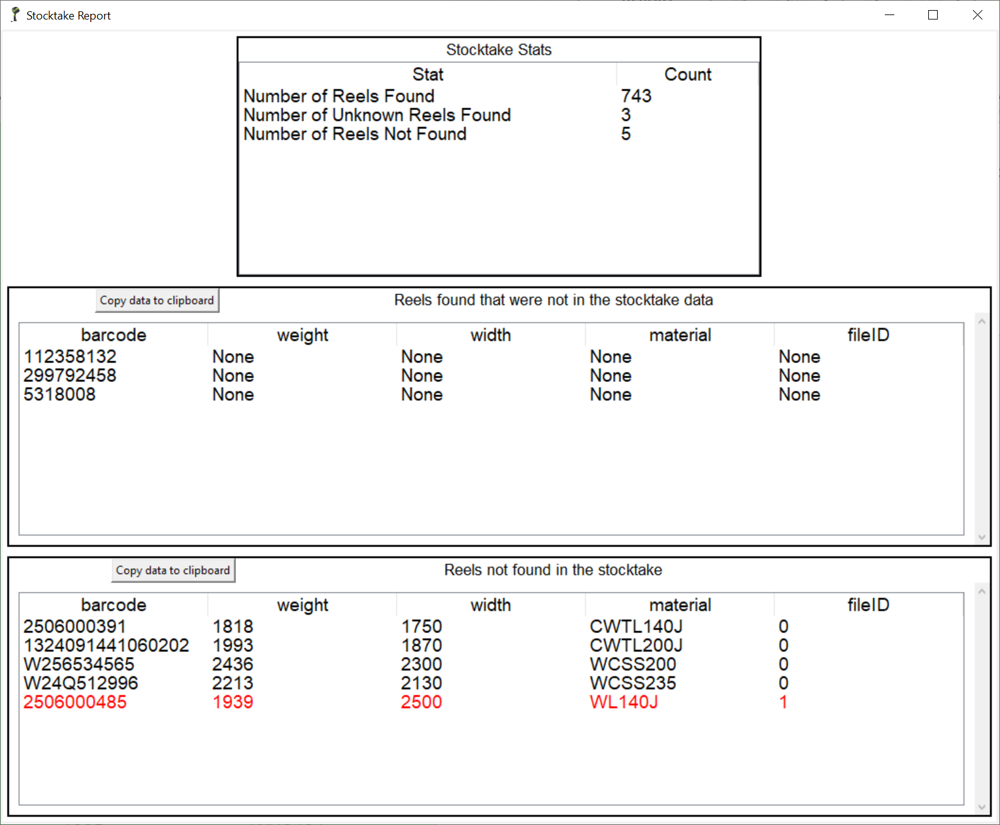

# ReelStock 0.2.0-alpha

Python application to perform a stocktake of reels of paper using a barcode scanner.

## Overview

This is a stocktake application to check that actual stock levels of reels of paper match the currently recorded stock levels from an Excel spreadsheet file.
Each 2 tonne reel of paper has a unique barcode. This barcode is scanned by a long range barcode scanner and is recorded as found by the application.
This application was created to speed up stocktake, which previously was done using binoculars and manually checking a printed list.

## Prerequisites

Developed and tested with Python 3.13.1 on Windows/PC and 3.11.2 on Linux/Raspberry Pi 5.
Third party libraries required:

- pandas


## Installation
### Using python:
Download the source and run with:
```python main.py```

### Using pyinstaller:
Download source and build a pyinstaller executable. This will allow running on machines without requireing a python environment already installed.
#### Create pyinstaller executable on Windows:
```pyinstaller --noconfirm --clean --name ReelStock --add-data "assets\icons;assets\icons" --add-data "assets\images;assets\images" --icon=assets\icons\Zebra64.ico main.py```
#### Create pyinstaller executable on Linux:
```pyinstaller --noconfirm --clean --name ReelStock --add-data "assets/icons:assets/icons" --add-data "assets/images:assets/images" --icon=assets/icons/Zebra64.ico main.py```

### Using pre-built PyInstaller executable:
Download a zip of the pre-built binaries from the "Releases" section for your platform (Windows or Raspberry Pi)

## Usage:
#### Start a stocktake on Windows:
To start a new stocktake test, drag and drop the Microsoft Excel spreadsheet of Reel data on top of the Reelstock.exe file.  This will open up the application and load the data as a new stocktake.
#### Start a stocktake on Linux:
Either setup a file association to open XLS files using the Reelstock executable, or open from the terminal with:
```Reelstock "path/to/mydata.xls"```

#### Continue a stocktake on Windows and Linux:
Run the executable without any files passed in. This starts up with the most recently saved stocktake.  If there is no previously saved stocktake, a file open dialog will come up allowing the manual opening of Reel data to start a new stocktake with.
### Main application Window:


At the top left of the main window is a text box.  This text box will display help information based on the area the mouse pointer is located. This will be updated to reflect how the current version of the application operates. Below is a general overview of how the application functions.

Current stock levels are loaded as an Excel spreadsheet.  ~~~Multiple files can be loaded at once, each files data is separated visually using a different colored text and that legend is displayed on screen.~~~(no longer required)  The column names determine how this data is intereted and is hard coded in the application.
A barcode scanner scans reels in the store which updates this data to show that the reels have been found.  The barcode scanner needs to be setup in USB HID keyboard mode and to prefix a 'f13' key and postfix an 'f14' key to every barcode as it is scanned.
The stocktake progress is saved after every barcode is scanned to allow shutdown and startup at any point without loss of stocktake information. 

### Report Window:



When all reels have been scanned a report can be generated to show what reels were missing as well as any reels found that were not in the stocktake data.
Report data can be copied to the clipboard to update whatever system is used. Currently I have it as tab delimited text.

## Roadmap:

This project is designed to contain everything needed to maintain / update the app in one place, so that anyone can run or extend its cababilities without relying on me personally.

### Planned Additions:

 - Scanner QR code setup image: a button to display the QR codes that are required to setup the Zebra 3738XR barcode scanner.
 - Customize report format or clipboard copy format to most suit how this data is used (I currently don't know the application stocktake data needs to be updated to)
 - Seprate format of stocktake data input into a seperate config file that can be edited seperately so the program can be modified to suit different input formats.

